# Laboratorio 03 (Gestión de Memoria) - Sistemas Operativos 
Elaborado por: 
- Carlos Andres Zuluaga Amaya
  andres.zuluaga6@udea.edu.co
- Duván Antonio Arboleda Botero
  duvan.arboleda1@udea.edu.co

Link de video: https://youtu.be/6s55R2jDwNI

## Introducción
En este laboratorio se estudia cómo los sistemas operativos administran la memoria. Se usan programas en C y herramientas de Linux como /proc, pmap y Valgrind.
Se analizan conceptos como espacio de direcciones, heap, stack, segmentación, paginación, fragmentación y TLB.

## Objetivo
- Identificar las regiones de memoria de un proceso: código, heap y stack.
- Detectar errores de memoria con Valgrind.
- Comprender los mecanismos de Base & Bounds, segmentación y paginación.
- Analizar cómo la fragmentación y el TLB afectan el uso y rendimiento de la memoria.

## Herramientas
Para este laboratorio es necesario tener instalado un compilador de C, principalmente gcc y también es necesario instalar Valgrind, para detectar errores de memoria.

### Compilación
```bash
gcc-Wall-o nombre nombre.c
```

### Valgrind
```bash
valgrind --leak-check=full ./nombre
```

La herramienta Valgrind se instala con `sudo apt install valgrind`

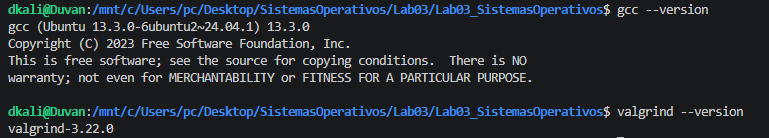

## Desarrollo

### 1. Espacio de Direcciones

#### 1.1 Programa base

En este paso vamos a crear el archivo `mem_map.c` donde imprime direcciones virtuales de distintas zonas de memoria: código, variable global, stack y heap.

```c
// mem_map.c
#include <stdio.h>
#include <stdlib.h>
#include <unistd.h>

int global_var = 42; /* segmento de datos (.data) */

int main() {
    int local_var = 10;                    /* stack */
    int *heap_var = malloc(sizeof(int)*100); /* heap */

    if (heap_var == NULL) {
        perror("malloc");
        return 1;
    }

    *heap_var = 99;

    printf("PID del proceso     : %d\n", getpid());
    printf("Dir. codigo (main)  : %p\n", (void*)main);
    printf("Dir. global_var     : %p\n", (void*)&global_var);
    printf("Dir. local_var      : %p\n", (void*)&local_var);
    printf("Dir. heap_var       : %p\n", (void*)heap_var);

    printf("\nPresione ENTER para continuar...\n");
    getchar();

    free(heap_var);
    return 0;
}
```

Vamos a compilar y ejecutar el programa

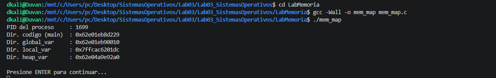

#### 1.2 Visualizar los mapas de memoria de un proceso
Al ejecutar ambos procesos, vemos que cada proceso tiene su propio espacio de direccion privado, administrado por el sistema operativo.

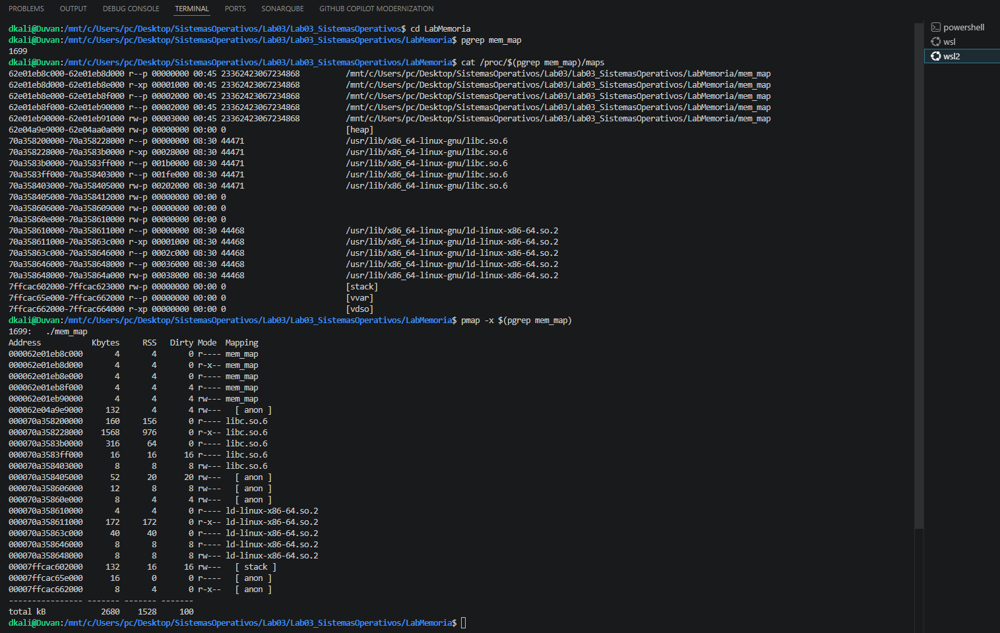

#### 1.3 Exploración de /proc/[pid]/maps

**1. Identifique en la salida de /proc/maps las regiones `text`, `heap` y `stack`. ¿Que permisos (r/w/x/p) tiene cada una? ¿Por qué difieren?**

En la salida de /proc/[pid]/maps:
- text: corresponde al ejecutable mem_map, sus permisos aparece como r-x-- (lectura y ejecución)
- heap: memoria dinámica reservada con malloc, sus permisos aparece comos rw--- (Consultar y guardar datos)
- stack: se guardan variables locales, direcciones de retorno y datos temporales, sus funciones aparece como rw--- (Escribir y leer constantemente durante la ejecución)

Estos permisos están diseñados para garantizar tanto la funcionalidad del programa como la seguridad del sistema operativo, y son los siguientes: 
- r (read): leer instrucciones
- w (write): escritura
- x (execute): ejecución
- p (private): Indica que la memoria es privada para el proceso.

**2. Compare las direcciones impresas con los rangos de /proc/maps. ¿A qué región pertenece cada variable?**

| Variable | Región en /proc/maps | Rango de direcciones |
|---|---|---|
| main | r-xp (mem_map) | 62e01eb8d000 - 62e01eb8e000 |
| global_var | rw-p (mem_map) | 62e01eb90000 - 62e01eb91000 |
| local_var | [stack] | 62e04a9e9000 - 62e04aa0a000 |
| heap_var | [heap] | 7ffcac602000 - 7ffcac623000 |

**3. ¿Qué otras regiones aparecen en el mapa (`libc`, `[vdso]`, `[vsyscall]`)? ¿Que función cumple cada una?**

- libc: biblioteca estándar de C, usada por funciones como printf, malloc y free.
- [vdso]: ejecutar algunas llamadas al sistema de forma más rápida.
- [vsyscall]: predecesor de vdso, relacionado con llamadas rápidas al sistema, mantenido por compatibilidad.
- [vvar]: zona con datos del kernel usados por el vdso.

**4. ¿Son las direcciones virtuales iguales a las fisicas? Explique apoyandose en el concepto de address space del OSTEP.**

Falso. Las direcciones que imprime el programa son direcciones virtuales, no físicas. Cada proceso cree tener su propio espacio de direcciones privado y continuo, pero el hardware traduce esas direcciones virtuales a direcciones físicas reales. 

#### 1.4 Comparar espacios de dos procesos simultáneos

Al ejecutar ambos procesos, vemos que cada proceso tiene su propio espacio de direccion privado, administrado por el sistema operativo.

| Terminal 1 | Terminal 2 |
|---|---|
| 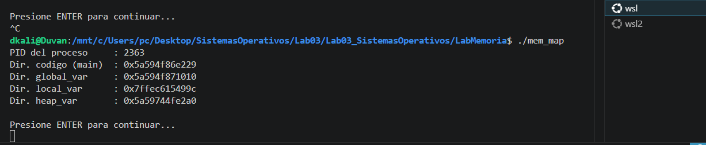 | 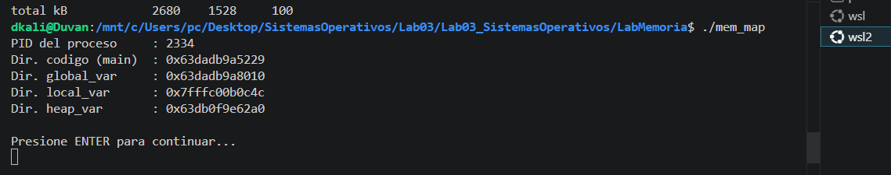 |

**1. ¿Son las mismas direcciones virtuales en ambos procesos? ¿Qué conclusión se saca sobre el aislamiento del espacio de direcciones?**

Se observó que las direcciones son diferentes, es decir, cada proceso tiene un espacio de direcciones virtual independiente. El sistema operativo le da a cada proceso su propia memoria privada. Esto permite que un proceso no pueda acceder directamente a la memoria de otro proceso, aunque ambos ejecuten el mismo programa.

**2. ¿Podría el Proceso A leer o modificar la variable global del Proceso B mediante su dirección virtual? Justifique.**

No. El Proceso A no puede leer ni modificar la variable global del Proceso B usando su dirección virtual. Esto demuestra el aislamiento entre procesos: cada proceso tiene su propia tabla de páginas y sus propias traducciones de direcciones virtuales a direcciones físicas. 

### 2. API de Memoria

#### 2.1 Programa base
En este paso vamos a crear el archivo `heap_demo.c` que reserva memoria dinámica en el heap usando malloc para almacenar, se usa realloc para ampliar el bloque de memoria y se libera la memoria con free.

```c
// heap_demo.c
#include <stdio.h>
#include <stdlib.h>

int main() {
    int n = 10;
    int *arr = (int *) malloc(n * sizeof(int));

    if (arr == NULL) {
        perror("malloc");
        return 1;
    }

    for (int i = 0; i < n; i++) {
        arr[i] = i * i;
    }

    printf("Arreglo original: ");
    for (int i = 0; i < n; i++) {
        printf("%d ", arr[i]);
    }
    printf("\n");

    /* Redimensionar a 20 enteros */
    arr = (int *) realloc(arr, 20 * sizeof(int));

    if (arr == NULL) {
        perror("realloc");
        return 1;
    }

    for (int i = n; i < 20; i++) {
        arr[i] = i * i;
    }

    printf("Arreglo ampliado: ");
    for (int i = 0; i < 20; i++) {
        printf("%d ", arr[i]);
    }
    printf("\n");

    free(arr);

    return 0;
}
```

Vamos a compilar y ejecutar el programa

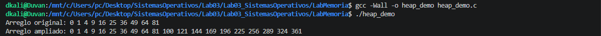

#### 2.2 Uso correcto de malloc y free

**1. Muestre la salida completa de Valgrind. ¿Reporta errores o fugas de memoria? ¿Que significa el mensaje "´All heap blocks were freed´"?** 

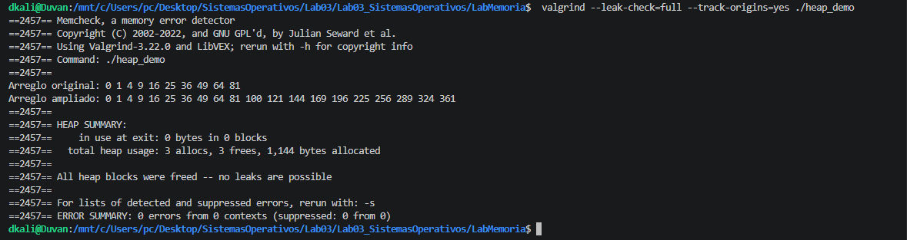

No. Valgrind no reporta errores ni fugas de memoria. El resumen indica `ERROR SUMMARY: 0 errors from 0 contexts`

`All heap blocks were freed -- no leaks are possible`: toda la memoria reservada dinámicamente durante la ejecución fue liberada correctamente antes de terminar el programa.

**2. ¿Porqué ese usa sizeof(int) en lugar del valor literal 4? ¿Qué ventaja ofrece en portabilidad entre arquitecturas?**

Se usa `sizeof(int)` porque el tamaño de un int puede depender de la arquitectura y el compilador.

**3. ¿Qué devuelve malloc cuando no hay memoria disponible? ¿Porqué es critico verificar ese valor antes de usarlo?**

Cuando malloc no puede reservar memoria, devuelve NULL. Esta verificación es crítica porque, si malloc falla y el programa intenta usar el puntero estaría accediendo a una dirección inválida. 

#### 2.3 Código con bugs de memoria

Se creó el archivo buggy_mem.c, el cual contiene tres errores de manejo de memoria.

```c
// buggy_mem.c -- NO ejecutar sin Valgrind
#include <stdio.h>
#include <stdlib.h>
#include <string.h>

int main() {
    /* ERROR 1: buffer overflow */
    int *p = malloc(5 * sizeof(int));

    for (int i = 0; i <= 5; i++) { /* <= en vez de < */
        p[i] = i;
    }

    /* ERROR 2: memory leak, nunca se llama free(q) */
    char *q = malloc(100);
    strcpy(q, "hola mundo");
    printf("%s\n", q);

    /* ERROR 3: use-after-free */
    free(p);
    printf("p[0] = %d\n", p[0]); /* acceso ilegal */

    return 0;
}
```

La ejecución con Valgrind permite detectar estos errores en tiempo de ejecución

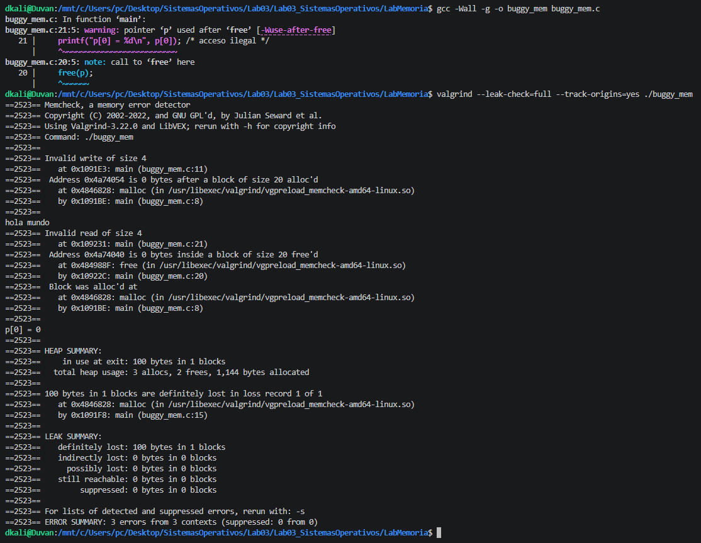

#### 2.4 Identificar y corregir errores de memoria

**1. Transcriba los mensajes que arroja Valgrind. ¿Cual mensaje corresponde a cada uno de los tres errores clásicos?**

- Error 1: Buffer Overflow,
  Mensaje de Valgrind: ==2523== Invalid write of size 4 
- Error 2: Memory Leak
  Mensaje de Valgrind: ==2523== LEAK SUMMARY 
- Error 3: Acceso Ilegal 
  Mensaje de Valgrind: ==2523== Invalid read of size 4

**2. Corrija el programa (buggy-mem-fixed.c) y verifique con Valgrind que no queda ningun error y ni fuga**

Código corregido:

```
// buggy_mem_fixed.c
#include <stdio.h>
#include <stdlib.h>
#include <string.h>

int main() {
    /* Correccion 1: reservar 5 enteros y usar solo indices 0 a 4 */
    int *p = malloc(5 * sizeof(int));

    if (p == NULL) {
        perror("malloc p");
        return 1;
    }

    for (int i = 0; i < 5; i++) {
        p[i] = i;
    }

    /* Correccion 2: reservar memoria para q y liberarla al final */
    char *q = malloc(100);

    if (q == NULL) {
        perror("malloc q");
        free(p);
        return 1;
    }

    strcpy(q, "hola mundo");
    printf("%s\n", q);

    /* Usar p antes de liberarlo */
    printf("p[0] = %d\n", p[0]);

    /* Liberar toda la memoria reservada */
    free(p);
    free(q);

    return 0;
}
```

Después de compilar y ejecutar buggy_mem_fixed.c con Valgrind, se verificó que no quedaran errores ni fugas de memoria.

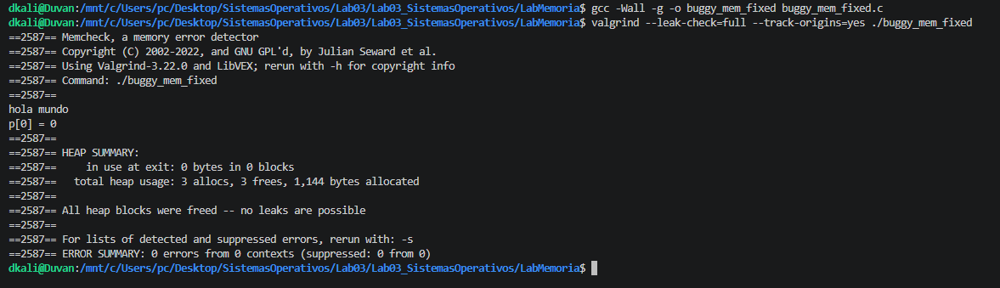

**3. ¿Qué consecuencias puede tener un use-after-free en un programa real en términos de seguridad y estabilidad del sistema?**

Un use-after-free puede causar problemas graves en un programa real. En términos de estabilidad, puede producir resultados incorrectos, bloqueos inesperados porque el programa está usando memoria que ya no le pertenece. En términos de seguridad, es peligroso. Si esa memoria liberada es reutilizada para otros datos, un atacante podría manipular el contenido y lograr corrupción de memoria.

### 3. Traducción de direcciones — Base & Bounds

#### 3.1 Simulador

Vamos a crear el archivo base_bounds.c se implementa un simulador de traducción de direcciones virtuales a físicas usando los registros base y bounds

```c
// base_bounds.c
#include <stdio.h>

typedef struct {
    int base;
    int bounds;
} Registro;

/* Traduce VA -> PA; imprime excepcion si viola bounds */
int traducir(Registro r, int va) {
    if (va < 0 || va >= r.bounds) {
        printf(" [EXCEPCION] VA=%d viola bounds=%d\n", va, r.bounds);
        return -1;
    }

    return r.base + va;
}

int main() {
    Registro procA = {32, 64};    /* base=32, bounds=64 */
    Registro procB = {128, 80};   /* base=128, bounds=80 */

    int vas[] = {0, 10, 63, 64, 100};
    int n = sizeof(vas) / sizeof(vas[0]);

    printf("--- Proceso A (base=%d, bounds=%d) ---\n",
           procA.base, procA.bounds);

    for (int i = 0; i < n; i++) {
        int pa = traducir(procA, vas[i]);

        if (pa != -1) {
            printf(" VA=%3d -> PA=%3d\n", vas[i], pa);
        }
    }

    printf("--- Proceso B (base=%d, bounds=%d) ---\n",
           procB.base, procB.bounds);

    for (int i = 0; i < n; i++) {
        int pa = traducir(procB, vas[i]);

        if (pa != -1) {
            printf(" VA=%3d -> PA=%3d\n", vas[i], pa);
        }
    }

    return 0;
}
```

#### 3.2 Base & Bounds — Análisis

**1. Compile y ejecute. Muestre la salidacompleta. ¿Que ocurre al acceder a VA=64 y VA=100
en el Proceso A? ¿Que haria el SO real ante esta excepcion?**

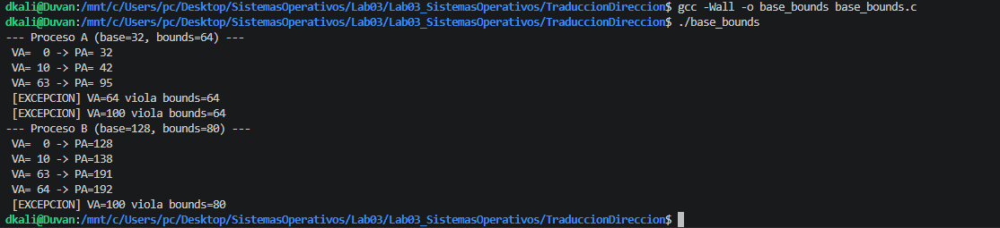

En el caso del Proceso A, con base = 32 y bounds = 64, las direcciones virtuales válidas van de 0 a 63. Por eso, VA = 64 y VA = 100 producen excepción. En el Proceso B, con base = 128 y bounds = 80, las direcciones virtuales válidas van de 0 a 79, por lo que VA = 64 todavía es válida, pero VA = 100 genera excepción.

**2. Agregue un Proceso C (base=0, bounds=32) al programa y traduzca las mismas VAs.¿Puede el Proceso A acceder a las direcciones del Proceso C directamente? Justifique.**

Vamos agregar el Proceso al archivo base_bounds.c
```c
Registro procC = {0, 32}; /* base=0, bounds=32 */
```

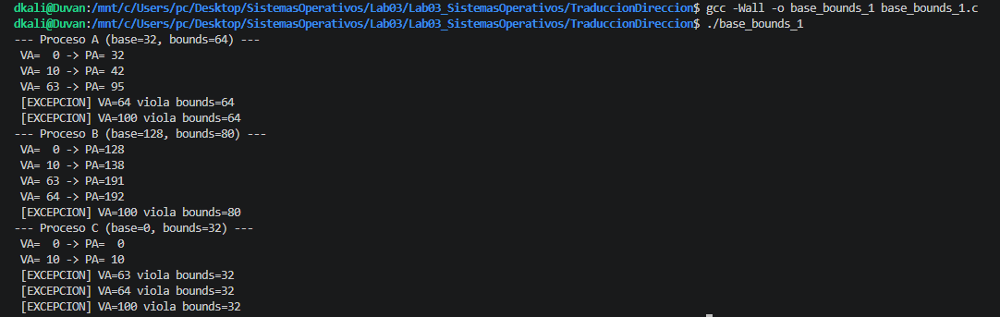

¿Puede el Proceso A acceder a las direcciones del Proceso C directamente? No. Aunque ambos procesos usen direcciones virtuales, cada uno tiene su propio par base/bounds. 

**3. ¿Cuál es la limitación principal del esquema base & bounds que motiva el surgimiento de la segmentacion?**

La principal limitación de Base & Bounds es que requiere asignar a cada proceso un bloque contiguo de memoria física. Esto puede desperdiciar espacio y generar problemas de utilización de memoria.

### 4. Segmentación

#### 4.1 Traducción manual con tabla de segmentos

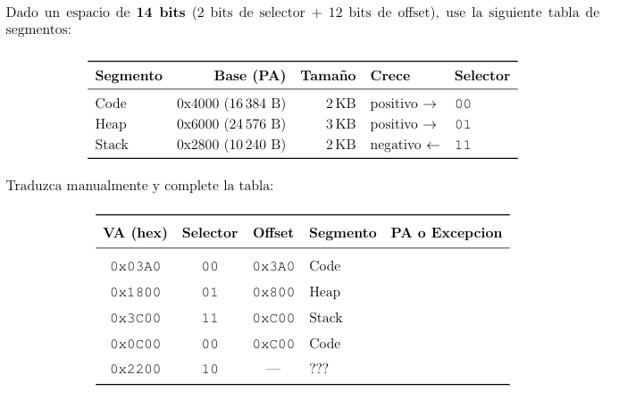

**1. Muestre el cálculo paso a paso para cada VA.**

Para cada dirección, extraemos el selector y el offset, verificamos los límites de tamaño y calculamos la Dirección Física (PA).
1. VA: 0x03A0,  PA = Base + Offset = 0x4000 + 0x3A0 = 0x43A0
2. VA: 0x1800, PA = 0x6000 + 0x800 = 0x6800
3. VA: 0x3C00, es un segmento con crecimiento negativo PA = 0x2800 - 1024 = 0x2400
4. VA: 0x0C00, Segmentation Fault (El offset excede el tamaño del segmento)
5. VA: 0x2200, Segmento no válido (No hay ninguna entrada en la tabla para el selector 10).

**2. ¿Por qué el Stack crece en dirección negativa? ¿Que ajuste especial requiere la formula al calcular el PA?**

El stack crece en dirección negativa porque normalmente se ubica en la parte alta del espacio de direcciones virtuales y se expande hacia direcciones menores. Esto permite que el heap crezca hacia arriba y el stack crezca hacia abajo, aprovechando mejor el espacio entre ambos.

**3. ¿Qué ventaja tiene la segmentación frente a base & bounds en cuanto a utilizacion de la memoria física?**

La segmentación permite dividir el espacio de direcciones en regiones lógicas independientes, lo que mejora la utilización de memoria frente a Base & Bounds. Sin embargo, puede generar fragmentación externa, ya que los segmentos tienen tamaños variables y pueden dejar huecos libres no contiguos en la memoria física.

**4. ¿Qué es la fragmentación externa? ¿Por qué surge con segmentación? Ilustre con un diagrama de bloques de memoria**

La fragmentación externa ocurre cuando la memoria libre total es suficiente, pero está dividida en varios huecos pequeños no contiguos. Entonces, una solicitud grande puede fallar porque no existe un bloque libre continuo suficientemente grande.

### 5. Paginación

#### 5.1 Cálculo de la tabla de páginas

Teniendo en cuenta el sistema: 


**1. ¿Cuantos bits se necesitan para el VPN y Cuantos para el offset? Muestre el cálculo.**

Offset: Como el tamaño de página es 4 KB = 2^(12) bytes, se necesitan 12 bits para direccionar cada byte dentro de una página.

VPN: Se obtiene restando los bits del offset al total del espacio virtual: VPN = Espacio virtual} - Offset

**2. ¿Cuantas entradas tiene la tabla de páginas de un proceso?**
El número de entradas está determinado por la cantidad de páginas posibles, lo cual depende de los bits del VPN: Entradas = 2^{VPN bits}

**3. ¿Cuanta memoria ocupa la tabla de paginas completa? ¿Es razonable ese tamaño para cada proceso?**

Para hallar el tamaño total, multiplicamos el número de entradas por el tamaño de cada entrada (PTE):

```
Tamaño de tabla = Número de entradas x Tamaño de PTE
// Tamaño de tabla = 2^20 * 4 bytes = 4 MB
```

No es razonable para este sistema en particular. Según los datos, el espacio físico total es de solo 1 MB (20 bits). Una tabla de páginas de 4 MB para un solo proceso es cuatro veces más grande que toda la memoria RAM disponible, lo qque es imposible ejecutar incluso un único proceso bajo este esquema de tabla de páginasç.

**4. ¿Cuantos bits necesita el PFN dentro de la PTE? ¿Que información almacenan los bits restantes? Mencione al menos 3 bits de control y su función**

El PFN (Physical Frame Number) identifica el marco físico en la memoria RAM. Se calcula restando el offset al espacio físico total:

```
PFN bits = Espacio físico - Offset
```

Información de los bits restantes: Cada PTE tiene 4 bytes (32 bits). Si el PFN usa 8 bits, sobran 24 bits (32 - 8 = 24). Estos se utilizan para bits de control que gestionan la seguridad y el estado de la página.

3 Bits de control y su función:
- Present/Valid Bit: Indica si la página se encuentra actualmente en la memoria física (RAM) o si debe buscarse en el disco (generando un page fault).
- Read/Write Bit: Determina los permisos de la página
- Dirty Bit: Se activa cuando el contenido de la página ha sido modificado.

#### 5.2  Simulador de paginación

Vamos a crear paging_sim.c

```c
// paging_sim.c
#include <stdio.h>

#define PAGE_BITS 4
#define PAGE_SIZE (1 << PAGE_BITS)              /* 16 bytes/pagina */
#define VA_BITS 8                               /* VA de 8 bits */
#define NUM_PAGES (1 << (VA_BITS - PAGE_BITS))  /* 16 paginas */

/* Tabla de paginas: -1 = pagina no presente (PAGE FAULT) */
int page_table[NUM_PAGES] = {
    3, -1, 7, 2, -1, 1, -1, 5,
    -1, -1, 4, -1, 6, -1, 0, -1
};

void traducir(int va) {
    int vpn = va >> PAGE_BITS;
    int offset = va & (PAGE_SIZE - 1);

    printf("VA=0x%02X VPN=%2d Offset=%2d ", va, vpn, offset);

    if (page_table[vpn] == -1) {
        printf("-> PAGE FAULT (pagina no presente)\n");
    } else {
        int pfn = page_table[vpn];
        int pa = (pfn << PAGE_BITS) | offset;
        printf("-> PFN=%2d PA=0x%02X\n", pfn, pa);
    }
}

int main() {
    int vas[] = {0x00, 0x0F, 0x20, 0x35, 0x10, 0xA3, 0xC8, 0xF0};
    int n = sizeof(vas) / sizeof(vas[0]);

    printf("%-22s %-6s %-8s %-6s %s\n",
           "VA", "VPN", "Offset", "PFN", "PA");
    printf("-----------------------------------------------------\n");

    for (int i = 0; i < n; i++) {
        traducir(vas[i]);
    }

    return 0;
}
```

#### 5.3 Simulador — Análisis

**1. Compile y ejecute el simulador. Muestre la salida completa.**

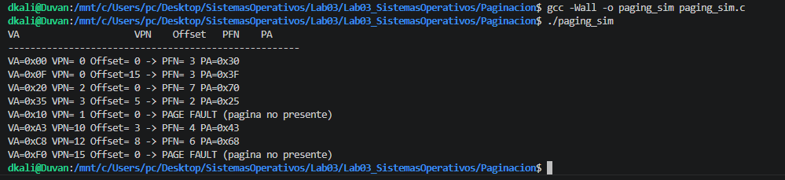

**2. ¿Que ocurre con las VAs 0x10 y 0xA3? ¿Que debería hacer el SO real ante un page fault?**

Lo que ocurre con estas direcciones demuestra la diferencia entre un mapeo exitoso y un fallo de página:
- VA 0x10 (16 en decimal): Al desplazar 4 bits a la derecha ($0x10 >> 4$), obtenemos un VPN = 1.
  Al consultar la tabla de páginas, el valor almacenado es -1. Donde el sistema detecta que la página no está cargada en la memoria física, con generar un Page Fault.
- VA 0xA3 (163 en decimal): El VPN es 10. El Offset es 3 (0x3 en hexadecimal)
  Al consultar, encontramos el PFN = 4. y con el cálculo de la PA, se toma el PFN (4) y se concatena con el offset (3), resultando en la dirección física 0x43. Siendo la traducción exitosa.

En un sistema operativo real, cuando ocurre un page fault, el procesador genera una excepción y transfiere el control al sistema operativo. El SO revisa si el acceso es válido. Si es válido, carga la página desde disco o desde memoria secundaria hacia un marco físico, actualiza la tabla de páginas y reintenta la instrucción. Si el acceso no es válido, termina el proceso, normalmente con un error de segmentación.

**3. ¿Cuantos accesos a memoria física requiere completar una instrucción load con tabla de paginas de un solo nivel? ¿Por que es costoso y que solución de hardware existe?**

Sin TLB, una instrucción load requiere normalmente dos accesos a memoria física: un acceso para leer la entrada de la tabla de páginas y un acceso para leer el dato real en memoria física. Es decir 2 accesos. Esto es costoso porque cada acceso a memoria virtual requiere primero consultar la tabla de páginas. En otras palabras, la traducción de direcciones agrega un acceso extra a memoria antes de poder leer el dato.

La solución de hardware es el TLB (Translation Lookaside Buffer). El TLB es una caché de traducciones recientes VPN -> PFN. Si la traducción está en el TLB, no es necesario consultar la tabla de páginas en memoria, reduciendo el costo de traducción.

**4. ¿Que ventaja tiene la paginación sobre la segmentación en cuanto al fenomeno de fragmentación?**

La paginación evita la fragmentación externa, porque divide tanto la memoria virtual como la memoria física en bloques de tamaño fijo

### 6. Gestión de espacio libre 

#### 6.1 Simulación de estrategias de asignación

Tenemos la siguiente lista libre: 

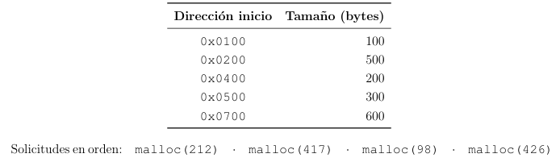

**1. Para cada solicitud indique que bloque asigna first fit. Muestre la lista libre resultante tras las 4 asignaciones.**

| Solicitud     | Bloque Seleccionado | Cálculo / Residuo                          |
|---------------|---------------------|--------------------------------------------|
| malloc(212)   | 0x0200 (500)        | Quedan 288 bytes en 0x02D4                 |
| malloc(417)   | 0x0700 (600)        | Quedan 183 bytes en 0x08A1                 |
| malloc(98)    | 0x0100 (100)        | Quedan 2 bytes en 0x0162                   |
| malloc(426)   | NINGUNO             | No hay bloques ≥ 426. **FALLA.**           |

Lista libre resultante (First Fit):
- 0x0162 (2 bytes)
- 0x02D4 (288 bytes)
- 0x0400 (200 bytes)
- 0x0500 (300 bytes)
- 0x08A1 (183 bytes)

**2. Repita con best fit. ¿Cambia el resultado?**

| Solicitud     | Bloque Seleccionado | Residuo                          |
|---------------|---------------------|----------------------------------|
| malloc(212)   | 0x0500 (300)        | Quedan 88 bytes en 0x05D4        |
| malloc(417)   | 0x0200 (500)        | Quedan 83 bytes en 0x03A1        |
| malloc(98)    | 0x0100 (100)        | Quedan 2 bytes en 0x0162         |
| malloc(426)   | 0x0700 (600)        | Quedan 174 bytes en 0x08AA       |

El resultado es distinto. con Best Fit logró completar las 4 asignaciones con éxito.

**3. ¿Cuál estrategia genera mas fragmentación externa en este caso? ¿Cuál la minimiza?**

Estrategia con mas fragmentación: First Fit. 
Estrategia que la minimiza: Best Fit. 

**4. ¿Qué es el coalescing? Ilustre un caso donde su ausencia provoca que una solicitud de 250 bytes falle aunque haya suficiente memoria total libre.**

El coalescing (coalescencia) es la técnica de fusionar bloques de memoria libre contiguos para formar un único bloque más grande. Sin esto, la memoria se fragmenta en pedazos pequeños inútiles.

Caso de falla (sin coalescing): Imagina que tienes dos bloques libres adyacentes:
- Bloque A: 150 bytes.
- Bloque B: 150 bytes.
- Total memoria libre: 300 bytes.

Si llega un malloc(250), la solicitud fallará porque ningún bloque individual es suficiente, a pesar de que hay 300 bytes libres en total. Si existiera coalescing, se unirían en un solo bloque de 300 y la solicitud tendría éxito.

**5. ¿Que es la fragmentación interna? ¿Cuando aparece tipicamente al usar un slab allocator?**

La fragmentación interna ocurre cuando se asigna a un proceso un bloque de memoria ligeramente más grande de lo que solicitó. El espacio sobrante dentro de ese bloque asignado se desperdicia porque no puede ser usado por nadie más.

En un Slab Allocator, aparece típicamente porque este asignador maneja "cachés" de objetos de tamaño fijo (slabs de 32 bytes, 64 bytes, 128 bytes).

#### 6.2 Fragmentación

Vamos a crear el archivo fragmentation.c

```c
// fragmentation.c
#include <stdio.h>
#include <stdlib.h>

#define N 10

int main() {
    void *ptrs[N];
    int sizes[] = {16, 32, 64, 128, 256, 512, 1024, 512, 256, 128};

    /* Asignar N bloques de tamanos variados */
    for (int i = 0; i < N; i++) {
        ptrs[i] = malloc(sizes[i]);
        printf("malloc(%4d) -> %p\n", sizes[i], ptrs[i]);
    }

    /* Liberar indices pares para crear huecos */
    printf("\nLiberando bloques en indices pares...\n");

    for (int i = 0; i < N; i += 2) {
        free(ptrs[i]);
        ptrs[i] = NULL;
    }

    /* Intentar asignar un bloque grande */
    void *big = malloc(1500);

    printf("\nmalloc(1500) -> %p [%s]\n",
           big, big ? "exito" : "FALLO");

    if (big) {
        free(big);
    }

    for (int i = 1; i < N; i += 2) {
        free(ptrs[i]);
    }

    return 0;
}
```

y compilamos:

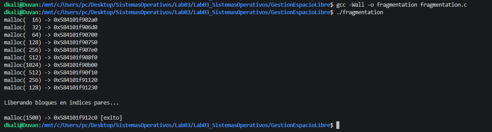

#### 6.3 Fragmentación en glibc — Análisis

**1. ¿Son consecutivas en memoria las direcciones asignadas? ¿Que patrón de separación observa entre bloques contiguos?**

¿Son consecutivas? No estrictamente ya que las direcciones son crecientes, existe una diferencia mayor al tamaño solicitado entre cada puntero. Siendo su patrón de separación entre malloc(32) y malloc(64), la diferencia es de 0x30 ($48$ bytes).

**2. ¿Tiene exito la asignación final de 1500 bytes? Explique el resultado en términos de fragmentación.**

Si, tuvo exito. Aunque se libero los índices pares (0, 2, 4, 6 y 8), la suma de esa memoria liberada ($16 + 64 + 256 + 1024 + 256 = 1616$ bytes) no está disponible como un único bloque contiguo. Los bloques de los índices impares (32, 128, 512, etc.) siguen ocupados que impiden la unión de los espacios libres. 

**3. Consulta: ¿Cual es la diferencia entre el allocator de usuario (malloc/glibc) y el del kernel (buddy system, slab)? ¿Por que existen dos niveles de gestión de memoria?**

|  | Allocator de Usuario | Allocator de Kernel |
|----------------|-------------------------------------|------------------------------------|
| Objetivo       | Gestionar peticiones pequeñas y frecuentes de aplicaciones. | Gestionar páginas de memoria física y estructuras del kernel. |
| Unidad mínima  | Bytes (muy granular).               | Páginas (usualmente 4 KB).         |
| Estrategia     | Mantiene "free lists" y optimiza para velocidad. | Buddy System (potencias de 2) y Slab (cachés de objetos fijos). |

Existen dos niveles porque cada uno resuelve un problema diferente. El allocator de usuario administra memoria para un programa específico y el allocator del kernel administra los recursos físicos globales del sistema. 

### 7. TLBs —Translation Lookaside Buffer

Se creo el archivo tlb_locality.c

```c
// tlb_locality.c
#include <stdio.h>
#include <stdlib.h>
#include <time.h>

#define N (1 << 22)  /* 4M enteros = 16 MB */

double ms(struct timespec a, struct timespec b) {
    return (b.tv_sec - a.tv_sec) * 1000.0
         + (b.tv_nsec - a.tv_nsec) / 1e6;
}

int main() {
    int *arr = (int *) malloc(N * sizeof(int));

    if (arr == NULL) {
        perror("malloc arr");
        return 1;
    }

    for (int i = 0; i < N; i++) {
        arr[i] = i;
    }

    struct timespec t0, t1;
    long sum = 0;

    /* Acceso SECUENCIAL --- alta localidad espacial */
    clock_gettime(CLOCK_MONOTONIC, &t0);

    for (int i = 0; i < N; i++) {
        sum += arr[i];
    }

    clock_gettime(CLOCK_MONOTONIC, &t1);

    printf("Secuencial : %8.2f ms (sum=%ld)\n", ms(t0, t1), sum);

    /* Acceso ALEATORIO --- baja localidad */
    int *idx = (int *) malloc(N * sizeof(int));

    if (idx == NULL) {
        perror("malloc idx");
        free(arr);
        return 1;
    }

    for (int i = 0; i < N; i++) {
        idx[i] = i;
    }

    srand(42);

    /* Fisher-Yates shuffle */
    for (int i = N - 1; i > 0; i--) {
        int j = rand() % (i + 1);
        int t = idx[i];
        idx[i] = idx[j];
        idx[j] = t;
    }

    sum = 0;

    clock_gettime(CLOCK_MONOTONIC, &t0);

    for (int i = 0; i < N; i++) {
        sum += arr[idx[i]];
    }

    clock_gettime(CLOCK_MONOTONIC, &t1);

    printf("Aleatorio  : %8.2f ms (sum=%ld)\n", ms(t0, t1), sum);

    free(arr);
    free(idx);

    return 0;
}
```

#### 7.1 Localidad y TLB — Análisis

**1. ¿Cuantas veces mas lento es el acceso aleatorio frente al secuencial? Muestre el promedio de 3 ejecuciones de tlb_locality.?**

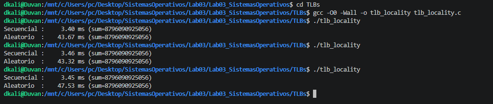

Basándonos en las 3 ejecuciones, realizamos los siguientes cálculos:

| Ejecución | Secuencial (ms) | Aleatorio (ms) |
|-----------|-----------------|----------------|
| 1         | 3.40            | 43.67          |
| 2         | 3.46            | 43.32          |
| 3         | 3.45            | 47.53          |
| Promedio  | **3.437 ms**    | **44.84 ms**   |

El acceso aleatorio es aproximadamente 13 veces más lento (44.84/3.437 = 13.04) que el acceso secuencial.

**2. Explique con el modelo del TLB porque el acceso aleatorio es mas lento. ¿Que ocurre con el hit rate en cada caso?**

El TLB es un caché de hardware de alta velocidad que almacena las traducciones recientes de direcciones virtuales a físicas.

- Acceso Secuencial: Presenta una alta localidad espacial. Como los datos están uno tras otro, una sola entrada en la TLB sirve para miles de accesos consecutivos. El hit rate es cercano al 100%.
- Acceso Aleatorio: Presenta una nula localidad. Cada salto aleatorio probablemente cae en una página diferente que no está en la TLB. Esto provoca constantes TLB misses, obligando al hardware a realizar un "page table walk" (consultar la memoria principal), lo cual es órdenes de magnitud más lento. El hit rate cae drásticamente.

**3. Si el tamaño de pagina fuera 64 KB en lugar de 4 KB, ¿mejoraria o empeoraría la situación con accesos aleatorios? Justifique desde el punto de vista del TLB y del uso de memoria.**

Mejoraria, ya cada entrada de la TLB cubriría 16 veces más memoria 64 KB / 4 KB = 16. Incluso con accesos aleatorios, hay una mayor probabilidad de que dos accesos caigan en la misma "página gigante", reduciendo los misses.

#### 7.2 Comportamiento de los TLB
**1. Un TLB con 64 entradas (fully associative) y paginas de 4 KB. ¿Cuanta memoria puede cubrir sin generar misses? ¿Es suficiente para un proceso moderno tipico?**

64 entradas x 4 KB/página = 256 KB. Para un proceso moderno, no es suficiente ya que 256 KB cubren apenas una fracción minúscula de sus datos

**2. Consulte: ¿Que es un TLB shootdown y en que situación ocurre en sistemas multiprocesador? ¿Por que es una operación costosa?**

TLB Shootdown es cuando un núcleo de CPU modifica una entrada en la tabla de páginas y debe notificar a todos los demás núcleos que sus copias locales de esa traducción en sus TLB ya no son válidas. Es costoso porque requiere Inter-Processor Interrupts (IPIs).

**3. Explique la diferencia entre TLB gestionado por hardware (CISC/x86) y por software (RISC/MIPS). ¿Cual ofrece mayor flexibilidad al dise˜nador del SO y por que?**

La gestión por hardware (CISC/x86) es más rápida pero rígida, mientras que la gestión por software (RISC/MIPS) es más flexible pero más lenta.

El enfoque gestionado por software, ya que el diseñador del SO no está atado a una estructura de datos impuesta por el fabricante del chip. Esto permite experimentar con formatos de tabla de páginas más eficientes para cargas de trabajo específicas sin cambiar el hardware.

## Conclusiones

Durante el desarrollo del laboratorio se logró comprender de manera práctica cómo un sistema operativo administra la memoria de los procesos, identificando regiones como el stack, heap y segmento de código mediante herramientas reales de Linux.
El uso de herramientas como Valgrind permitió evidenciar la importancia de una correcta gestión de memoria en programación en C, especialmente para prevenir errores críticos como buffer overflows, memory leaks y use-after-free, los cuales pueden afectar la estabilidad y seguridad de un sistema.
Se comprobó que cada proceso posee su propio espacio de direcciones virtual independiente, lo que garantiza aislamiento y protección entre procesos gracias a los mecanismos de traducción de memoria implementados por el sistema operativo y el hardware.
La práctica con Base & Bounds permitió entender las primeras técnicas de protección y traducción de memoria, así como sus limitaciones, especialmente la necesidad de memoria contigua, lo que motivó la evolución hacia esquemas más avanzados como la segmentación y la paginación.
Con la segmentación se comprendió cómo dividir la memoria en regiones lógicas mejora la organización de los programas, aunque introduce problemas de fragmentación externa cuando los segmentos tienen tamaños variables.
El estudio de la paginación mostró cómo este mecanismo elimina la fragmentación externa mediante el uso de páginas y marcos de tamaño fijo, además de evidenciar el papel fundamental de las tablas de páginas y del TLB en el rendimiento del sistema.
Las simulaciones de gestión de espacio libre permitieron analizar cómo diferentes estrategias de asignación de memoria generan distintos niveles de fragmentación, destacando la importancia de técnicas como el coalescing para mejorar el aprovechamiento de la memoria disponible.
Finalmente, el análisis del comportamiento del TLB y la localidad de referencia permitió concluir que la forma en que un programa accede a la memoria influye directamente en el rendimiento. Los accesos secuenciales aprovechan mejor la caché y el TLB, mientras que los accesos aleatorios generan una gran cantidad de fallos y reducen considerablemente el desempeño.
En conclusión general, el laboratorio permitió relacionar la teoría de gestión de memoria con experimentos reales en Linux, fortaleciendo la comprensión sobre cómo los sistemas operativos optimizan el uso de memoria, protegen procesos y mejoran el rendimiento de ejecución de los programas.
